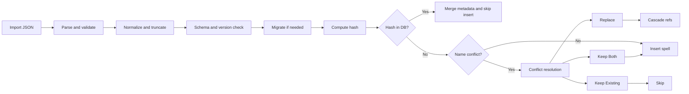

# Design: Integrate Spell Hashing into Ecosystem

## Context

The application is moving from ID-based spell identity to content-addressable identity (canonical content hash). Spec #1 defines the hashing contract and canonical serialization; Spec #2 covers migrating stored data to the new model. This change integrates that model into search, vault, import/export, spell lists, and character spellbooks.

**Definitions:** **Spell List** — per-class known/prepared spell sets stored in `character_class_spell`, not a separate list entity. **Content hash** — 64-character lowercase hex SHA-256 of the canonical spell JSON (see `docs/architecture/canonical-serialization.md`). **Replace with New** — overwrite the existing spell row with imported content and cascade the new content hash in `character_class_spell` and `artifact` references.

**Key reference:** The `CanonicalSpell` type and its serialization/hashing contract are defined in `docs/architecture/canonical-serialization.md`. All references to canonical serialization, metadata stripping, and hash computation in this document follow that contract.

**Current state:**

- **Search**: Legacy `spell` table has an FTS5 virtual table (`spell_fts`) indexing name, description, material_components, tags, source. Queries use this for keyword search; there is no indexing of the new structured/canonical fields.
- **Vault**: User data lives in a single SpellbookVault directory with `spellbook.db` and `attachments/`. Spell definitions are stored in the database; there is no content-addressable spell file layer yet.
- **Import/Export**: Existing flows use integer IDs; sharing spells across instances risks ID collisions and does not support safe deduplication.
- **Spell lists & characters**: Reference spells by ID; they must move to hash-based references for portability and version stability. In this change, **Spell List** means the per-class spell sets (known/prepared) stored in `character_class_spell`, not a separate list entity.

**Constraints:**

- Must not break existing data before or during migration (Spec #2 handles migration; this work consumes migrated data).
- Canonical serialization and hashing are fixed by Spec #1 and the canonical-serialization doc; this design does not redefine them.
- Local-first: no mandatory network; all validation and indexing are local.

**Stakeholders:** Users (search, import/export, conflict resolution), developers (vault GC, FTS triggers, security boundaries).

## Goals / Non-Goals

**Goals:**

- **Search**: Full-text search over spell description and over the human-readable text generated from structured fields (e.g. range, duration, area)—i.e. the text those types are composed from, not the complex types themselves—so users can find spells by content.
- **Vault**: Store spell definitions in a content-addressable way (filename = hash) so duplicate content is deduplicated and integrity is verifiable.
- **Import/Export**: Hash-based interchange (export ID = content hash), deduplication by hash, and a clear conflict-resolution flow when the same name has a different hash. **Export always uses the current app schema version (`CURRENT_SCHEMA_VERSION`); downgrading for older recipients is out of scope.** **Export format:** Single-spell export = one `CanonicalSpell` JSON (required top-level `schema_version`). Bundle export = wrapper object with required `schema_version`, required `bundle_format_version`, and a `spells` array of `CanonicalSpell`.

**Export format examples:**

Single-spell export:
```json
{
  "schema_version": 2,
  "id": "a1b2c3d4e5f6...",
  "name": "Fireball",
  "tradition": "ARCANE",
  "level": 3,
  "school": "Evocation",
  "description": "A bright streak flashes...",
  "content_hash": "a1b2c3d4e5f6..."
}
```

Bundle export:
```json
{
  "schema_version": 2,
  "bundle_format_version": 1,
  "spells": [
    { "schema_version": 2, "id": "a1b2c3...", "name": "Fireball", "...": "..." },
    { "schema_version": 2, "id": "d4e5f6...", "name": "Magic Missile", "...": "..." }
  ]
}
```
Note: `id` in exports equals the spell's `content_hash`, not the local integer ID. The `schema_version` in these examples reflects the app's current standard (v2). **The JSON examples above are illustrative only; actual exports include all non-null `CanonicalSpell` fields per the canonical serialization doc** (including `components`, `casting_time`, `is_cantrip`, `raw_legacy_value`, `source_text`, etc.).

- **References**: Spell lists and character spellbooks reference spells by content hash; missing spells are handled gracefully (e.g., placeholder or clear error).
- **Security**: Rigorous validation and sanitization of imports (size limits, schema validation, no script injection), and safe FTS query construction.

**Non-Goals:**

- Defining or changing the canonical schema or hash algorithm (Spec #1).
- Migrating legacy data into the new schema (Spec #2).
- Spell editor UI or editing workflows (Spec #3: `update-spell-editor-structured-data`).
- Changing how attachments (e.g., images) are stored in the vault; only spell-definition storage is in scope for hash-based filenames.

## Decisions

### 1. FTS: Extend vs new table

- **Decision:** Extend `spell_fts` (or recreate it with additional columns) so that FTS indexes the spell description and all searchable text derived from structured data in `canonical_data`—i.e. the human-readable text those fields generate (e.g. range, duration, area, saving throw), not the raw complex types. Keep FTS5 as the search engine; use triggers so the index stays in sync with spell insert/update/delete. FTS5 virtual tables do not support ALTER; extend by recreating `spell_fts` with the new columns and repopulating (e.g. via migration script).

**FTS migration checklist (Migration 0014):**

> **Note:** This migration also corrects a pre-existing bug in the `spell_ad` and `spell_au` triggers from Migrations 0003/0005, where empty strings were passed in the FTS5 `'delete'` command instead of `old.*` values, leaving stale index entries. The new triggers fix this as part of the extension.

1. DROP TRIGGER IF EXISTS `spell_ai`, `spell_ad`, `spell_au`
2. DROP TABLE IF EXISTS `spell_fts`
3. CREATE VIRTUAL TABLE `spell_fts` USING fts5(name, description, material_components, tags, source, author,
    canonical_range_text, canonical_duration_text, canonical_area_text, canonical_casting_time_text,
    canonical_saving_throw_text, canonical_damage_text, canonical_mr_text, canonical_xp_text,
    content='spell', content_rowid='id')
   `spell.id` is the table's rowid (INTEGER PRIMARY KEY), so `content_rowid='id'` is correct.
4. CREATE new triggers (`spell_ai`, `spell_ad`, `spell_au`) that populate all columns including the new canonical text columns. **Important:** The `spell_ad` (AFTER DELETE) and `spell_au` (AFTER UPDATE) triggers must pass `old.*` values — including `json_extract(old.canonical_data, ...)` for canonical text columns — in the FTS5 `'delete'` command. Do NOT pass empty strings (the pre-existing pattern in migrations 0003/0005), as this leaves stale index entries per the FTS5 external content docs.
5. Repopulate FTS via explicit INSERT…SELECT (do NOT use `INSERT INTO spell_fts(spell_fts) VALUES('rebuild')` — the `rebuild` command reads directly from the content table by column name, but the canonical text columns don't exist on the `spell` table, so they would be NULL):
   ```sql
   INSERT INTO spell_fts(rowid, name, description, material_components, tags, source, author,
       canonical_range_text, canonical_duration_text, canonical_area_text, canonical_casting_time_text,
       canonical_saving_throw_text, canonical_damage_text, canonical_mr_text, canonical_xp_text)
   SELECT id, name, description, material_components, tags, source, author,
       json_extract(canonical_data, '$.range.text'),
       json_extract(canonical_data, '$.duration.text'),
       json_extract(canonical_data, '$.area.text'),
       COALESCE(json_extract(canonical_data, '$.casting_time.text'), '') || ' ' || COALESCE(json_extract(canonical_data, '$.casting_time.raw_legacy_value'), ''),
       COALESCE(json_extract(canonical_data, '$.saving_throw.raw_legacy_value'), '') || ' ' || COALESCE(json_extract(canonical_data, '$.saving_throw.notes'), ''),
       COALESCE(json_extract(canonical_data, '$.damage.source_text'), '') || ' ' || COALESCE(json_extract(canonical_data, '$.damage.notes'), '') || ' ' || COALESCE(json_extract(canonical_data, '$.damage.dm_guidance'), ''),
       COALESCE(json_extract(canonical_data, '$.magic_resistance.source_text'), '') || ' ' || COALESCE(json_extract(canonical_data, '$.magic_resistance.notes'), '') || ' ' || COALESCE(json_extract(canonical_data, '$.magic_resistance.special_rule'), ''),
       COALESCE(json_extract(canonical_data, '$.experience_cost.source_text'), '') || ' ' || COALESCE(json_extract(canonical_data, '$.experience_cost.notes'), '') || ' ' || COALESCE(json_extract(canonical_data, '$.experience_cost.dm_guidance'), '')
   FROM spell;
   ```

**Canonical text columns for FTS indexing:**
- `canonical_range_text`: Extracted from `canonical_data → range → text` (RangeSpec.text)
- `canonical_duration_text`: Extracted from `canonical_data → duration → text` (DurationSpec.text)
- `canonical_area_text`: Extracted from `canonical_data → area → text` (AreaSpec.text)
- `canonical_casting_time_text`: Extracted from `casting_time.text` and `casting_time.raw_legacy_value`.
- `canonical_saving_throw_text`: Extracted from `saving_throw.raw_legacy_value` and `saving_throw.notes`.
- `canonical_damage_text`: Extracted from `damage.source_text`, `damage.notes`, and `damage.dm_guidance`.
- `canonical_mr_text`: Extracted from `magic_resistance.source_text`, `magic_resistance.notes`, and `magic_resistance.special_rule`.
- `canonical_xp_text`: Extracted from `experience_cost.source_text`, `experience_cost.notes`, and `experience_cost.dm_guidance`.

These are the text-bearing fields from each structured spec type. The FTS triggers must extract these from the `canonical_data` JSON column using `json_extract()`.

**Vector search (`spell_vec`):** The existing vector embedding table is not modified by this change. Vector embeddings are keyed by rowid (matching `spell.id`) and are not affected by hash-based identity changes. Recomputing embeddings when canonical data changes is deferred to a future iteration.

- **Rationale:** FTS5 is already in use and matches the architecture spec (hybrid search). The intent is to search over description and over the text that structured fields are composed from, so users can find spells by content. A single FTS table aligned with the existing `spell` table keeps the model simple.
- **Alternatives considered:** (a) Keep only legacy FTS and ignore structured text — rejected because the capability spec requires indexing structured fields. (b) Replace FTS with an external search engine — rejected for local-first and complexity.

### 2. Vault spell storage: hash-named files

- **Decision:** Store spell definitions in the vault under a subfolder `spells/` as `spells/{content_hash}.json`. File content must match the hash (integrity check on read/write).
- **Mandatory Metadata Merging:** When importing a spell whose hash already exists in the library (DB), the application **must merge metadata** (append unique `tags` and `source_refs`) rather than silently skipping or overwriting. **GC timing (recommended):** The system SHOULD run vault GC automatically after each successful import (post-import cleanup). On-demand GC via a "Optimize Vault" UI trigger is required. Either or both approaches are valid; this aligns with the vault spec's SHOULD.

  **Vault file content:** The vault file stores the **full `CanonicalSpell` JSON** (including metadata such as `id`, `source_refs`, `schema_version`, `created_at`, `updated_at`). This ensures vault files are self-contained and can be used for reimport or recovery without DB access. **Integrity check:** On read, the system recomputes the content hash by applying the canonical serialization contract (normalize → validate → strip metadata → apply JCS normalization → SHA-256) to the file content — it does NOT hash the raw file bytes. The `normalize` step is version-aware and includes migration (e.g. `migrate_to_v2()`) if a lower schema version is encountered. On write, the system verifies the computed hash matches the target filename before committing the file.

  The database remains the source of truth for “which spells exist”; vault files are content-addressable storage that can be GC’d when no spell references them. Vault files are written on spell insert/update (content-addressable by content hash). On spell delete, the vault file may be removed by either: (a) immediate deletion when the last reference is removed, or (b) deferred GC when no `spell` row AND no `artifact.spell_content_hash` references that hash. **Both approaches are valid**; the implementation may choose either or both (e.g., immediate delete for explicit user actions, GC for batch operations). Verification must cover both scenarios.

  **Concurrency:** GC MUST NOT run concurrently with import operations. The implementation should either: (a) acquire a mutex/lock that prevents GC during active imports, or (b) restrict GC to user-initiated actions that are mutually exclusive with import (e.g., GC button is disabled while import is in progress). This prevents the race condition where GC deletes a vault file for a hash that is about to be inserted by a concurrent import.

  **Vault integrity check:** The vault integrity check MUST run before every GC operation. Additional timing (e.g. on application startup when the vault is opened, on-demand from Settings) is configurable via a user-facing option. The application MUST provide a configuration option to enable/disable automatic integrity checks at vault open. The check detects missing spell files and re-exports from DB `canonical_data` when available; see the Vault spec for recovery scenarios.
- **Rationale:** Content-addressable storage gives deduplication, safe sharing, and integrity. Using the same hash as in the DB and in import/export keeps one canonical identifier across the ecosystem.
- **Alternatives considered:** (a) Keep spells only in DB — rejected because the delta spec requires the vault to support hash-based spell storage. (b) Store by name — rejected (collision and versioning issues).

### 3. Import conflict resolution: name vs hash

- **Decision:** When an imported spell has the same name as an existing spell but a different content hash, treat it as a conflict and present resolution options: Keep Existing, Replace with New, Keep Both (e.g., “Fireball (1)”), and "Apply to All” for the current import session only (not persisted).

**"Replace with New" semantics:** Replace performs an UPDATE on the existing spell row (preserving its integer `id`). The row’s `canonical_data`, `content_hash`, and related fields are strictly overwritten with the imported spell’s data; metadata (tags, source_refs) are also strictly overwritten, not merged. The old `content_hash` value is no longer present on any spell row. To preserve character and spell list integrity, the application MUST perform a **cascading update**: all instances of the old content hash in `character_class_spell.spell_content_hash` and `artifact.spell_content_hash` MUST be updated to the new content hash via application-level UPDATE statements (not SQLite FK cascade — `spell_id` is preserved on the same row, so the FK does not fire). The replace and all required cascades MUST run in a single DB transaction; if any required cascade update fails, the entire replace MUST roll back with no partial updates committed. The old vault file is subject to GC. **If the replacement hash already exists as a different spell in the library**, the Replace operation MUST fail with a clear error (e.g., "This version already exists in your library as [Spell Name]") — the unique index on `spell.content_hash` will otherwise reject the UPDATE. A future enhancement could preserve old versions via soft-delete or version history, but that is out of scope for this change.

**Cascading update edge cases:** Cascade updates apply to KNOWN and PREPARED entries independently as part of the same replace transaction. If any required cascade update fails (e.g. unique constraint violation because Hash B already exists in that character's list), the transaction MUST roll back and the import MUST report a Replace failure for that spell; no partial updates are allowed. **change_log entries:** When "Replace with New" updates a spell row successfully, the application MUST create `change_log` entries recording the field changes (at minimum: `content_hash`, `canonical_data`).

For large batches (≥ 10 conflicts), offer a summary dialog (Skip All, Replace All, Keep All, Review Each) to avoid dialog fatigue. Summary dialog options apply only to the current import session (same as "Apply to All"); they are not persisted. If the user chose a default in the summary dialog (e.g. Replace All), that default is applied to all conflicts without showing per-spell dialogs unless they chose Review Each. "Keep All" means "Keep Both" for every conflict (create (1), (2), … for each); naming follows the same collision rule (increment until unique). **When the user enters "Review Each" from the batch summary, the per-conflict "Apply to All" option remains available and applies the choice to all subsequent conflicts in that session.**
- **Rationale:** Same name + different hash means the user might be updating a spell or importing a variant; forcing one behavior (e.g., always replace) would be surprising. Explicit resolution respects user intent. Numeric suffix (1), (2), … is the single convention for "Keep Both". **Collision handling:** If "Fireball (1)" already exists, increment to (2), (3), etc. until a unique name is found. **The uniqueness check for the numeric suffix considers both the pre-import library state and all spells already committed in the current import transaction** (so that importing 3 conflicting "Fireball" variants in one batch with "Keep Both" correctly produces (1), (2), (3)).
- **Alternatives considered:** (a) Always replace — rejected (data loss risk). (b) Always keep both — rejected (clutter; user should choose).

**Deduplication (same hash):** When an imported spell’s content hash already exists in the DB, do not insert a new row. Instead, skip insertion and **merge** metadata from the import into the existing spell. **Merge rules (for Deduplication ONLY):** (1) Tags: union of existing and imported tags, no duplicates; if merged count exceeds 100, keep the first 100 alphabetically sorted. (2) `source_refs`: append imported refs, deduplicate by key policy: if both refs have non-empty `url`, deduplicate by `url`; otherwise deduplicate by `(system, book, page, note)`. If merged count exceeds 50, keep existing refs first, then new refs up to the limit. (3) Max limits: tags <= 100, source_refs <= 50. This keeps the library deduplicated while preserving new provenance.

**Export `id` field:** In the export format, `id` is set to the spell's `content_hash` (not the local integer ID). On import, `id` is treated as the content hash for deduplication. The local integer ID is never included in exports and is assigned by the importing system. This keeps exports portable across instances.

**Import pipeline order (per spell):** Apply metadata normalization and truncation (tags ≤100, source_refs ≤50) first; then validate structure and schema/bundle format version; then run migration (e.g. `migrate_to_v2()`) if needed; then compute content hash; then perform deduplication and conflict detection. This order ensures hashes are comparable and version-consistent.



**Partial import failure handling and transaction boundaries:** Import uses a phased flow to avoid long-lived interactive transactions:
1. **Pre-scan phase (no DB write transaction):** parse input, validate schema/size/depth, compute hashes, detect duplicates and name conflicts.
2. **Decision phase (no DB write transaction):** collect user conflict choices (including batch defaults/apply-to-all).
3. **Apply phase (single DB write transaction):** apply all inserts/updates/skips according to the resolved plan, with per-row failure capture for recoverable failures.

If a spell fails pre-scan validation (schema error, oversized fields), it is SKIPPED and added to an error report. Valid planned operations are committed in the apply transaction. The import result includes: (a) count of successfully imported spells, (b) count of duplicates skipped by deduplication broken down as: total skipped, of which N had metadata merged and M had no changes, (c) count of conflicts resolved (with sub-counts per resolution choice), and (d) a list of validation failures with spell name and error reason. The user is shown a summary on completion. **Intra-bundle deduplication:** Spells are processed in document order. When a bundle contains two spells with the same computed hash, the first is inserted (or deduplicated against the DB) and subsequent ones are treated as duplicates of the first.

### 4. Security: import limits and validation

- **Decision:** Enforce file size limits (e.g., reject > 100 MB, warn/confirm > 10 MB), validate JSON schema and structure (reject deeply nested or huge arrays), sanitize text before display (XSS), and ensure FTS queries use parameterized/controlled construction (no raw user string in MATCH to prevent injection). Use a single bound parameter for the FTS MATCH expression (e.g. `… WHERE spell_fts MATCH ?`) and sanitize/escape FTS special characters in application code before binding. **FTS5 escaping strategy (two-tier):**

- **Basic search (default):** Escape ALL FTS5 special characters (`"`, `*`, `(`, `)`, `^`, `:`, `-`, `+`) and wrap the query as a phrase. Boolean keywords (`AND`, `OR`, `NOT`, `NEAR`) that appear in user input are treated as literal text, not operators. This is the safe default for most users.
- **Advanced search (opt-in):** When the query contains recognized boolean syntax (uppercase `AND`, `OR`, `NOT` as standalone whitespace-delimited tokens), treat them as FTS5 operators and pass them through unescaped. The `NEAR` keyword is always escaped and never exposed to users (too confusing and error-prone for non-expert use). All other special characters (`"`, `*`, `(`, `)`, `^`, `:`, `-`, `+`) are still escaped. A lightweight tokenizer distinguishes operators from content words. The advanced mode parser rejects malformed operator expressions (e.g., trailing `AND`, consecutive operators) and falls back to basic-escaped search.
- **Detection heuristic:** If the trimmed query contains at least one uppercase boolean keyword (`AND`, `OR`, `NOT`) surrounded by whitespace or string boundaries (e.g., regex `(^|\s)(AND|OR|NOT)(\s|$)`), activate advanced mode. Otherwise, use basic mode. This avoids false positives from spell names like "Fire and Ice" (lowercase "and" stays in basic mode).
- **URL validation for `source_refs`:** Applies when optional `source_refs[].url` is present. Allowed protocols are `http:`, `https:`, and `mailto:`. Reject `javascript:`, `data:`, and all other protocols. (`ipfs:` is not supported unless explicitly added in a future revision.)
- **Policy toggle:** `import.sourceRefUrlPolicy` controls behavior for rejected URLs. Default: `drop-ref` (drop invalid SourceRef, import spell with warning). Optional strict mode: `reject-spell` (reject entire spell).
- **Rationale:** Import is a primary attack surface (malicious or malformed files). Size and structure limits mitigate DoS; sanitization and safe FTS mitigate injection. Binding the search string as a single parameter and escaping FTS operators prevents injection while keeping the pattern clear for implementers. Implementers should follow [SQLite FTS5 full-text query syntax](https://www.sqlite.org/fts5.html#full_text_query_syntax) when building the escaped or advanced query string before binding.
- **Alternatives considered:** (a) Trust imported content — rejected. (b) Sandbox parsing in a separate process — optional future hardening; not required for this change.

### 5. Spell list and character migration to hash references

- **Decision:** Spell list items and character spellbook entries (both stored in `character_class_spell`) reference spells by `content_hash`. Migrate existing ID-based references to hashes by resolving current IDs to their spell’s content hash (after Spec #2 migration). If a referenced spell is missing (e.g., after import or GC), show a clear placeholder or “Spell no longer in library” and optionally offer to remove the reference. Explicit spell upgrade (character sheet) is offered when the same display name has another spell row with a different `content_hash`; the user may then update the reference from the old hash to the new one.
- **Rationale:** Specs require list/character portability and immutable references by hash; migration is a one-time step per list/character, then all new references are hash-based.
- **Alternatives considered:** (a) Keep dual ID + hash — rejected for long-term complexity. (b) No migration — rejected (would leave broken references after schema switch).

**Schema approach (recommended):** Add a `spell_content_hash TEXT` column (nullable) to `character_class_spell` and to **`artifact`**. Define an index `CREATE INDEX idx_artifact_spell_content_hash ON artifact(spell_content_hash)` to support fast lookups during Vault GC and cascading updates. Note: `artifact` already has a `hash TEXT NOT NULL` column (Migration 0009) which stores the artifact's own file content hash. The new `spell_content_hash` is distinct - it stores the spell's canonical content hash for lookup/joins. Only `character_class_spell` and `artifact` are in scope; the deprecated `spellbook` table is not modified (read-only/legacy). The `spellbook` table was deprecated in Migration 0007 which migrated all data to `character_class_spell`. No hash-based changes are made to it. A future migration may drop it entirely. Backfill from `spell.content_hash` where `spell.id = character_class_spell.spell_id` (and similarly for `artifact.spell_id`). **Nullability note:** `spell_content_hash` will be NULL for any row whose referenced spell has `content_hash IS NULL` (i.e., pre-Spec #2 spells). Migration 0015 depends on Spec #2's v1->v2 bulk migration having completed so that all `spell.content_hash` values are non-NULL; any remaining NULL values must be handled in application reads. The parallel unique index `idx_ccs_character_hash_list` on `(character_class_id, spell_content_hash, list_type)` does not enforce uniqueness for NULL values (SQLite NULLs are distinct in unique indexes), so duplicate entries in the transition period are possible for un-migrated spells. Use `spell_content_hash` for all application reads and joins (join to `spell` on `spell.content_hash = ...`). **Unique constraint transition:** The existing `UNIQUE(character_class_id, spell_id, list_type)` constraint remains during the migration period. A parallel unique index `CREATE UNIQUE INDEX idx_ccs_character_hash_list ON character_class_spell(character_class_id, spell_content_hash, list_type)` is added in Migration 0015 to enforce data integrity on the new column from the start. Both coexistence mechanisms run during the dual-column period. When `spell_id` is dropped in a future migration, the old constraint goes with it, and application-level delete logic must replace the FK cascade for artifact cleanup. Keep `spell_id` for the migration period so foreign-key integrity and rollback remain possible; a later migration can drop `spell_id` once the hash-based flow is proven. This avoids a big-bang schema change and keeps rollback viable.

**Out-of-scope tables:** `change_log` (Migration 0001) tracks changes by `spell_id`. The `change_log` table schema is not modified in this change and will continue to use `spell_id`. Adding `content_hash` to `change_log` is deferred to a future iteration. However, when spells are updated via "Replace with New" during import, `change_log` entries MUST still be created using the existing schema (recording field-level changes by `spell_id`).

### 6. Windows path length and vault layout

- **Decision:** Ensure full path to any vault file stays under 260 characters (Windows MAX_PATH). Vault spell files live under `spells/{content_hash}.json` (see Decision 2). If the vault root is user-configurable, document that a shorter path is recommended; log a warning if a path would exceed the limit and document mitigation (shorter base path).
- **Rationale:** Hash filenames are fixed length; the main variable is the vault root path. Explicit check avoids silent failures on Windows.
- **Alternatives considered:** (a) Ignore path length — rejected (support burden). (b) Use short hash prefix in path — possible future optimization if needed.

## Risks / Trade-offs

| Risk | Mitigation |
|------|------------|
| Bulk migration not run | If Migration 0015 runs before v2 bulk migration, backfill may see NULL `spell.content_hash`; application must handle NULL (design already notes nullability). |
| FTS and DB schema drift | Keep FTS populated via triggers or a single source view; run integrity checks in tests. |
| Vault GC deletes a file still referenced by DB | GC only remove files whose hash is not referenced by any spell row; run GC after DB state is committed; add tests for “reference exists but file missing” (repair or re-export). |
| Import conflict UI complexity | Ship both per-conflict and 10+ batch summary flows in this change; document precedence between summary defaults and per-conflict Apply-to-All. |
| Large imports (many spells) | Enforce max spells per import (e.g., 10k); stream parsing where possible; show progress for big files. |
| Path length exceeded on Windows | Validate/log path length at vault init or on first write; document shorter vault path as mitigation. |
| Ranking differences when moving from LIKE to FTS MATCH | Accept that relevance will change; tune FTS options (e.g., bm25) and document in release notes. |
| Performance: no benchmarks for GC duration or FTS rebuild time | Add benchmarks: GC for 10k vault files < 30s; FTS rebuild for 10k spells < 60s. |

## Migration Plan

1. **Order of work (recommended)**
   - **Foundation**: Execute the v1->v2 Bulk Migration (`migrate_all_spells_to_v2`) to ensure all `spell.content_hash` values in the DB are v2 compliant. **This is a hard prerequisite for all hash-based references** — Migration 0015 backfill depends on `spell.content_hash` being non-NULL for all spell rows. After this step, `canonical_data` should be non-NULL for all existing spells; the vault integrity test for NULL `canonical_data` (see verification plan) is a defensive check for edge-case rows that fail migration.
   - **Vault**: Implement vault hash-based spell storage (`spells/{content_hash}.json`) and integrity check; then GC (on-demand first; post-import GC is recommended per vault spec SHOULD).
   - **Search**: Add FTS indexing for all canonical text areas and switch search to MATCH (single `spell_fts` table, Migration 0014).
   - **Import/Export**: Implement export with `id` = content hash; then import with validation, migration (v1->v2), deduplication, and conflict resolution.
   - **Ecosystem**: Migrate spell list, character spellbook, and artifact spell references to hash (Migration 0015, backfilling from the now-v2 hashes in the `spell` table).
   - **Security/Optimization**: Parameterized FTS (single bound param + escape FTS special chars), size limits, sanitization, URL validation (`http:`, `https:`, `mailto:` only).
   - **Validation**: Documentation and E2E tests for import/export and conflict resolution.

**Migration trigger:** When or how `migrate_all_spells_to_v2` is run is out of scope for this change. The bulk migration is invoked via the existing Tauri command; the application or operator is responsible for running it (e.g. from Settings, on first launch after upgrade, or manually) before hash-based references and import/export rely on v2 hashes. This design assumes the migration has been executed as a prerequisite.

**Migration number reservations (current latest: 0013):**
- **0014**: FTS5 rebuild (drop/recreate spell_fts + triggers + repopulate)
- **0015**: Add `spell_content_hash` column to `character_class_spell` and `artifact` tables; add indexes

**Schema version compatibility:**

The app's current CanonicalSpell schema version and supported bundle format version are defined in code (e.g. `CURRENT_SCHEMA_VERSION` and `BUNDLE_FORMAT_VERSION`); all version checks in this spec refer to those values.

- `schema_version` is the CanonicalSpell schema version. Supported version is v2.
  - **Forward Compatibility**: Import MUST warn on spells with `schema_version` higher than the app's current version and continue best-effort processing (aligned with `docs/SCHEMA_VERSIONING.md`).
  - **Backward Compatibility**: Import MUST accept spells with `schema_version` equal to or lower than the current version. If a spell with a lower version is imported (e.g., v1), it MUST undergo the `migrate_to_v2()` transformation (see v2 schema spec) and full re-normalization **before** the content hash is computed. This ensures the importer generates the same hash the local system will use.
- `bundle_format_version` is the export envelope format version (distinct from spell schema version). Supported value is defined in code. Import MUST reject bundles with `bundle_format_version` higher than supported. Import MUST accept bundles with `bundle_format_version` equal to or lower than supported (backward-compatible). Single-spell exports do not have `bundle_format_version` and the importer must differentiate between single object and bundle object to avoid erroneously rejecting single spells for missing this field.

**Bundle wrapper vs item schema version precedence:** In bundle imports, each spell item's `schema_version` is authoritative for migration/normalization of that spell. Wrapper `schema_version` applies only to bundle envelope compatibility checks and MUST NOT override item-level processing.

2. **Deployment**
   - Ship behind existing feature surface (no new flags required if migration is automatic).
   - Ensure Spec #2 migration has run so `content_hash` and canonical data exist before FTS/vault/import rely on them.

3. **Rollback**
  - DB migrations for list/character hash references should remain mechanically reversible during the dual-column period (`spell_id` + `spell_content_hash` both present). A dedicated rollback script is out of scope for this change; verification covers data-path feasibility.
   - Vault: avoid deleting legacy spell files until the new hash-based flow is proven; keep rollback window where old code can still read legacy storage if needed.
   - Artifact rollback: `artifact.spell_content_hash` is nullable. Dropping the column in a rollback migration is sufficient since `artifact.spell_id` is preserved throughout the migration period.

## Resolved (pre-implementation decisions)

- **FTS table layout:** Single `spell_fts` extended with columns for canonical text (no second FTS table).
- **Vault layout:** Spell files stored as `spells/{content_hash}.json` (subfolder to avoid cluttering vault root).
- **“Apply to All” semantics:** Applies only to the current import session; not persisted as a user preference.
- **GC timing:** Implement on-demand GC first. Running GC automatically after each successful import is recommended (SHOULD per vault spec) but not required; implementation may choose either or both.
- **Settings keys:** `vault.integrityCheckOnOpen` controls automatic integrity checks on vault open. `import.sourceRefUrlPolicy` controls URL rejection behavior (`drop-ref` default, `reject-spell` optional strict mode).
