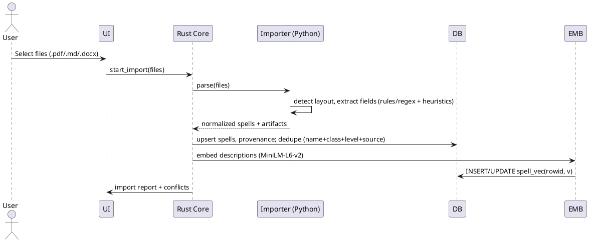

# SPEC-1-Local AD&D 2e Spellbook

**Related Specifications**:
- **[SPEC-2: 12th Circle & Quest Spells](spec_2_12th_circle_spells.md)**: Extends the data model for levels 10-12 (Arcane) and Quest spells (Divine).
- **[SPEC-3: Character Profiles](spec_3_character_profiles_feature.md)**: Deepens character management with abilities (STR/DEX/etc), race, and multi-class support.
- **[SPEC-4: Classes & Spell Lists](spec_4_classes_spell_lists_feature.md)**: Adds rigid class definitions, specialist school bans, and sphere access rules.


## Background

You want a **locally run** application to manage a character’s spellbook for **AD&D 2nd Edition**, with the following drivers:

- Full **offline**, privacy-first operation using **open-source** components only.
- Ability to **scale to thousands of spells** (including variants/homebrew) while staying fast on commodity hardware.
- Rich **search** (keyword, type/school/level, and contextual/semantic) to quickly find the right spell in and out of combat.
- **Import** spells from common document formats (PDF, Markdown, DOCX) and **export** selections to Markdown or PDF for sharing/printing.
- A lightweight, local **LLM “chat”** (T5-like small model) to answer questions about spells using only the on-disk collection.
- All **data stored locally**, user-controlled, with easy backup/restore.

This document will iteratively specify requirements, method, implementation, and milestones for an MVP that a contractor team can build directly.


## Requirements

Using MoSCoW prioritization and your confirmed constraints (Win/macOS/Linux desktop wrapper; personal/homebrew + OGL/permissioned content only):

### Must Have
- **Local-only, open-source stack**; no network dependency; all data stored in user directory with easy backup/restore.
- **Scale**: smooth performance with ~10k spells; cold start < 2s, search < 150ms P95 on mid-tier laptop CPU.
- **Data model** for AD&D 2e: name, school, sphere (cleric), level, range, components (V/S/M), casting time, duration, area/target, saving throw, description, source, tags, editions/variants, classes, reversible flag, material components text, author, permissions/licensing metadata.
- **Import**: batch import from **PDF**, **Markdown**, **DOCX**; per-file mapping UI; deduplicate by canonical keys (name+class+level+source) with merge review.
- **Export**: selected spells or full spellbook to **Markdown** and **PDF** (A4/Letter, printer-friendly, with optional stat-block styling).
- **Search**: keyword, faceted filters (school, level, class, components, duration, source), and **semantic/contextual** search over descriptions.
- **Local LLM “chat”**: small T5-like model for Q&A constrained to on-disk corpus; offline inference (CPU by default; optional GPU accel if present).
- **Desktop wrapper**: single codebase packaged for **Windows, macOS, Linux**.
- **License-safe content handling**: enforce labeling of imported content as homebrew/OGL/permissioned; never ship third‑party copyrighted data.
- **Auditability**: full-text index and embeddings entirely reproducible from the DB.

### Should Have
- **Spellbook collections** per character with prepared/known slots, notes, and per-session print packs.
- **Versioning**: keep original import artifact + normalized record; change history per spell.
- **Synonym/alias support** (e.g., British/American spelling, alternate names).
- **Bulk edit** and tag management.
- **Theming**: light/dark + high-contrast accessibility.
- **Simple plugin points** for custom normalizers/parsers.

### Could Have
- **Rules cross-reference**: link spells to conditions/items referenced in text (local link graph).
- **Image attachments** (tables, diagrams) stored locally and referenced in exports.
- **Dice roller** with exportable examples.
- **Optional LAN sync** via user-chosen folder sync tools (no built-in cloud).

### Won’t Have (v1)
- Multiuser concurrency or hosted/cloud features.
- Mobile apps.
- Non-open-source dependencies or telemetry.

### Constraints & Compliance
- 100% **open-source licenses** (permissive or copyleft acceptable) for runtime and tooling.
- **No external calls** during inference/search/import; optional model download performed manually/offline installer.
- Respect OGL/permission terms; user is responsible for content; app provides per-record provenance fields.

### Acceptance Criteria (MVP)
- Import 1,000+ mixed-format spells with < 1% unparsed critical fields after assisted mapping.
- Keyword+faceted queries return P95 < 150ms; semantic queries < 500ms P95 on CPU-only laptop.
- Export: generate a 100-spell PDF under 5s; Markdown export preserves all structured fields.
- Local chat answers at least 90% of a 50-question test set correctly with citations to local records.

## Method

### High-Level Architecture

```plantuml
@startuml
skinparam componentStyle rectangle
actor User
node "Tauri Desktop App" {
  [Frontend (React/Svelte)] as FE
  [Rust Core] as RC
  [Importer Sidecar (Python)] as IMP
}
node "Storage" {
  database "SQLite DB
(FTS5 + sqlite-vec)" as DB
  folder "Attachments" as FS
}
node "Local ML" {
  [Embeddings (Sentence-Transformers)] as EMB
  [LLM Q&A (FLAN-T5 via CTranslate2)] as LLM
}
User --> FE
FE <--> RC
RC <--> DB
RC <--> FS
RC <--> IMP
RC <--> EMB
RC <--> LLM
@enduml
```

**Rationale**
- **Tauri 2** for cross-platform desktop with small footprint and Rust backend. ([v2.tauri.app](https://v2.tauri.app/?utm_source=chatgpt.com))
- **SQLite + FTS5** for fast keyword search; portable DB with JSON features. ([sqlite.org](https://sqlite.org/fts5.html?utm_source=chatgpt.com))
- **Semantic search** stored in SQLite using **sqlite-vec** (HNSW-like ANN) for 384-d vectors. ([github.com](https://github.com/asg017/sqlite-vec?utm_source=chatgpt.com))
- **Embeddings**: `all-MiniLM-L6-v2` (384-dim, Apache-2.0, ~90MB) for CPU-friendly semantic indexing. ([huggingface.co](https://huggingface.co/sentence-transformers/all-MiniLM-L6-v2?utm_source=chatgpt.com))
- **Local LLM chat**: `flan-t5-small/base` converted & quantized with **CTranslate2** for fast CPU inference; supports T5/FLAN variants. ([github.com](https://github.com/OpenNMT/CTranslate2?utm_source=chatgpt.com))
- **Import pipeline**: Python sidecar using `pdfminer.six` for PDFs and `python-docx` for DOCX; Markdown via native parser or **Pandoc** when layout-heavy. ([pdfminersix.readthedocs.io](https://pdfminersix.readthedocs.io/?utm_source=chatgpt.com))

### Data Model (SQLite)

```sql
-- Core entities
CREATE TABLE spell (
  id INTEGER PRIMARY KEY,
  name TEXT NOT NULL,
  school TEXT,             -- e.g., Alteration, Conjuration
  sphere TEXT,             -- cleric spheres
  class_list TEXT,         -- JSON array string of classes (e.g., ["Mage", "Cleric"])
  level INTEGER NOT NULL,
  range TEXT,
  components TEXT,         -- e.g., "V,S,M"
  material_components TEXT,
  casting_time TEXT,
  duration TEXT,
  area TEXT,
  saving_throw TEXT,
  reversible INTEGER DEFAULT 0,
  description TEXT NOT NULL DEFAULT '',
  tags TEXT,               -- JSON array string
  source TEXT,
  edition TEXT DEFAULT 'AD&D 2e',
  author TEXT,
  license TEXT,            -- OGL/homebrew/permission note
  is_quest_spell INTEGER DEFAULT 0, -- 1 for Quest Spells (Tome of Magic)
  created_at TEXT DEFAULT (strftime('%Y-%m-%dT%H:%M:%SZ','now')),
  updated_at TEXT
);

-- Full text index for keyword search
CREATE VIRTUAL TABLE spell_fts USING fts5(
  name, description, material_components, tags, source, author, content='spell', content_rowid='id'
);

-- Triggers to keep FTS in sync
CREATE TRIGGER spell_ai AFTER INSERT ON spell BEGIN
  INSERT INTO spell_fts(rowid, name, description, material_components, tags, source, author)
  VALUES (new.id, new.name, new.description, new.material_components, new.tags, new.source, new.author);
END;
CREATE TRIGGER spell_ad AFTER DELETE ON spell BEGIN
  INSERT INTO spell_fts(spell_fts, rowid, name, description, material_components, tags, source, author)
  VALUES('delete', old.id, '', '', '', '', '', '');
END;
CREATE TRIGGER spell_au AFTER UPDATE ON spell BEGIN
  INSERT INTO spell_fts(spell_fts, rowid, name, description, material_components, tags, source, author)
  VALUES('delete', old.id, '', '', '', '', '', '');
  INSERT INTO spell_fts(rowid, name, description, material_components, tags, source, author)
  VALUES (new.id, new.name, new.description, new.material_components, new.tags, new.source, new.author);
END;

-- Embeddings for semantic search (sqlite-vec)
CREATE VIRTUAL TABLE spell_vec USING vec0(
  rowid INTEGER PRIMARY KEY,  -- mirrors spell.id
  v float[384]
);

-- Provenance & versioning
CREATE TABLE artifact (
  id INTEGER PRIMARY KEY,
  spell_id INTEGER REFERENCES spell(id) ON DELETE CASCADE,
  type TEXT CHECK(type IN ('pdf','md','docx')),
  path TEXT,
  hash TEXT,
  imported_at TEXT DEFAULT (strftime('%Y-%m-%dT%H:%M:%SZ','now')),
  UNIQUE(spell_id, path)
);

CREATE TABLE change_log (
  id INTEGER PRIMARY KEY,
  spell_id INTEGER REFERENCES spell(id) ON DELETE CASCADE,
  changed_at TEXT DEFAULT (strftime('%Y-%m-%dT%H:%M:%SZ','now')),
  field TEXT,
  old_value TEXT,
  new_value TEXT,
  actor TEXT DEFAULT 'local'
);

-- Spellbooks per character
CREATE TABLE character (
  id INTEGER PRIMARY KEY,
  name TEXT NOT NULL,
  type TEXT NOT NULL DEFAULT 'PC', -- 'PC' or 'NPC'
  notes TEXT
);
CREATE TABLE spellbook (
  character_id INTEGER REFERENCES character(id) ON DELETE CASCADE,
  spell_id INTEGER REFERENCES spell(id) ON DELETE CASCADE,
  prepared INTEGER DEFAULT 0,
  known INTEGER DEFAULT 1,
  notes TEXT,
  PRIMARY KEY(character_id, spell_id)
);

-- Note: SPEC-3 and SPEC-4 expand character and class tables significantly.
-- See those specs for the extended schema (character_ability, character_class, class_definition, spheres, etc).


-- Saved Searches
CREATE TABLE saved_search (
  id INTEGER PRIMARY KEY,
  name TEXT NOT NULL,
  filter_json TEXT NOT NULL,
  created_at TEXT DEFAULT (strftime('%Y-%m-%dT%H:%M:%SZ','now'))
);
```

### Import Pipeline


**Parsing details**
- PDF: `pdfminer.six` or `pymupdf` fallback when layout is complex (table extraction). DOCX: `python-docx`. Markdown: native parser; fallback `pandoc` for odd flavors. ([pdfminersix.readthedocs.io](https://pdfminersix.readthedocs.io/?utm_source=chatgpt.com))
- Field extraction templates per source; user-assisted mapping UI for unmatched fields.

### Search & Ranking
- **Keyword**: `SELECT * FROM spell_fts WHERE spell_fts MATCH ?` with rank by bm25.
- **Facets**: `WHERE school IN (...) AND level IN (...) AND class_list LIKE '%Cleric%'` using normalized JSON helpers.
- **Semantic**: cosine similarity in `sqlite-vec`: `ORDER BY distance(v, :qvec) ASC LIMIT 50`. Combine with keyword score via linear blend.

### Local Chat (RAG)
1. Convert query to embedding (MiniLM-L6-v2); retrieve top-K spells from `spell_vec` + `spell_fts`.
2. Build a prompt context (spell stat blocks + citations).
3. Run **FLAN-T5-small** in **CTranslate2** (int8) for answer generation grounded only in retrieved text; show citations.
4. Guardrails: if no relevant passages (similarity < threshold), return "I don’t have that locally".

### Export
- **Markdown**: template renderer to GitHub-flavored MD.
- **PDF**: route A) HTML->PDF via Tauri printing; route B) `pandoc` with LaTeX for stable typography, selectable A4/Letter. ([pandoc.org](https://pandoc.org/MANUAL.html?utm_source=chatgpt.com))

### Similar/Adjacent Projects (for inspiration)
- Desktop note apps with local search and export; Tauri apps for small footprint. ([v2.tauri.app](https://v2.tauri.app/?utm_source=chatgpt.com))
- SQLite-based semantic search using `sqlite-vec`. ([github.com](https://github.com/asg017/sqlite-vec?utm_source=chatgpt.com))


## Implementation

### Tech Stack (Pinned for MVP)
- **Shell**: Tauri 2 (Rust backend + WebView UI), React 18 + TypeScript + Vite.
- **DB**: SQLite 3 with FTS5 enabled; `sqlite-vec` extension for vector search.
- **ML sidecar (Python 3.14)**: `sentence-transformers` (MiniLM-L6-v2) for embeddings; `CTranslate2` for FLAN‑T5‑small int8 inference; `pdfminer.six`, `PyMuPDF`, `python-docx`, `pypandoc` (or external Pandoc) for import/export.
- **Styling/UI**: TailwindCSS + Radix UI. State: Zustand. Diagram rendering in exports via fenced PlantUML blocks (optional).

### Project Layout
```
/
  apps/desktop/                 # Tauri app root
    src/                        # React UI
    src-tauri/                  # Rust core (commands, DB, file I/O)
  services/ml/                  # Python sidecar (uv/venv managed)
  db/                           # Migrations, seeds
  scripts/                      # Dev & packaging scripts
```

### Build the Core
1. **Initialize Tauri + React**: `pnpm create tauri-app` (or `npm create tauri-app`) with React+TS template.
2. **Rust core crates**: `rusqlite`, `r2d2_sqlite` (pool), `serde`, `chrono`, optional `tauri-plugin-sql` for migrations.
3. **Ship SQLite extensions**: load `fts5` (builtin) and bundle `sqlite-vec` as a loadable extension; enable `sqlite3_auto_extension` on startup.
4. **Migrations**: place SQL from the Method section under `db/migrations` (using simple versioned `.sql` files) and run at app start.
5. **FTS and Vector indices**: create triggers for FTS sync; provide a background job to (re)embed un-embedded or changed records.

### Python Sidecar (ML & Import)
- **Process model**: spawn a local Python process on demand via Tauri command; communicate over stdio JSON-RPC.
- **Virtualenv**: create/activate on first run; cache under app data dir.
- **Endpoints**:
  - `embed(texts: string[]) -> float[384][]`
  - `llm_answer(query: string, contexts: [{id, text, citation}]) -> {answer, citations[], meta}`
  - `import(files: path[]) -> {spells[], artifacts[], conflicts[]}`
  - `export(spell_ids[], fmt: 'md'|'pdf', options) -> path`

### UI Flows
- **Library**: table + filters (level, school, class, components, tags, source); search box with `keyword | semantic` toggle.
- **Spell editor**: form for all fields, provenance display, history view, attachments panel; **Add/Update** existing or new spells; **Print** single-spell sheet.
- **Spellbook Builder (PC/NPC)**: create multiple named spellbooks per character; pick **schools & level ranges** to filter; drag‑add/remove spells; mark **Prepared/Known**; add per-spell notes; **Print** spellbook pack (prepared/known subsets) with compact or full stat‑block layouts.
- **Robust Search**: match on **name, description, material components, tags, source, author**; advanced filter chips for **school(s)** (multi-select) and **level range**; save common filters.
-  **Import wizard**: file pick → preview + field mapper → dedupe resolution → import report; supports **spells** and **spellbooks** (JSON/Markdown bundle) import.
- **Export**: select spells or a character/NPC spellbook → **Markdown** or **PDF**; options: A4/Letter, compact/full layout, include notes, include provenance; export **spellbooks** as shareable JSON/MD bundle.
- **Chat**: side panel; shows retrieved spells (top-K), final answer, and clickable citations.


### API Commands (Rust)

The Tauri backend exposes the following `snake_case` commands, using `AppError` for structured error handling.

**Spells Module**
- `get_spell(id: i64) -> Option<SpellDetail>`: Retrieve full spell details including artifacts.
- `list_spells() -> Vec<SpellSummary>`: List all spells (summary view).
- `create_spell(spell: SpellCreate) -> i64`: Create a new spell with validation.
- `update_spell(spell: SpellUpdate) -> i64`: Update spell fields and log changes.
- `delete_spell(id: i64)`: Soft delete or hard delete (currently hard delete).
- `upsert_spell(spell: SpellDetail) -> i64`: Insert or Update based on ID presence (used by importers).

**Search Module**
- `search_keyword(query: String, filters: Option<SearchFilters>) -> Vec<SpellSummary>`: FTS5 keyword search with facet filters (school, level, class, source, tags, quest status).
- `search_semantic(query: String) -> Vec<SpellSummary>`: Vector similarity search using `sqlite-vec`.
- `list_facets() -> Facets`: Retrieve available facets for filtering (schools, sources, etc.).
- `save_search(name: String, payload: SavedSearchPayload) -> i64`: Persist a search configuration.
- `list_saved_searches() -> Vec<SavedSearch>`: Retrieve saved searches.
- `delete_saved_search(id: i64)`: Remove a saved search.
- `chat_answer(prompt: String) -> ChatResponse`: RAG-based chat response.

**Characters Module**
- `create_character(name: String, character_type: String, notes: Option<String>) -> i64`: Create a PC or NPC.
- `list_characters() -> Vec<Character>`: List all characters.
- `get_character_spellbook(character_id: i64) -> Vec<CharacterSpellbookEntry>`: Retrieve a character's spellbook.
- `update_character_spell(character_id: i64, spell_id: i64, prepared: i64, known: i64, notes: Option<String>)`: Manage spell status (prepared/known).
- `remove_character_spell(character_id: i64, spell_id: i64)`: Remove a spell from a character's book.

**Import/Export Module**
- `preview_import(files: Vec<ImportFile>) -> PreviewResult`: Parse files and show preview before committing.
- `import_files(files: Vec<ImportFile>, allow_overwrite: bool, ...) -> ImportResult`: Execute import with optional artifact/conflict overrides.
- `resolve_import_conflicts(resolutions: Vec<ImportConflictResolution>) -> ResolveImportResult`: Apply user choices for merge/skip.
- `reparse_artifact(artifact_id: i64) -> SpellDetail`: Re-run parsing on an existing artifact.
- `export_spells(ids: Vec<i64>, format: String) -> String`: Export selected spells to a bundle/file.
- `print_spell(spell_id: i64, layout: String, page_size: Option<String>) -> String`: Generate a PDF for a single spell.
- `print_spellbook(character_id: i64, layout: String, ...) -> String`: Generate a PDF spellbook pack.

### Import Details
- **Detection**: sniff by extension; for PDFs try text extraction first (`pdfminer.six`); fallback to layout-aware blocks (PyMuPDF) when columns/tables present.
- **Normalization**: rule-based regex + heuristics mapping common 2e stat-block headings (Name, School, Level, Range, Components, Casting Time, Duration, Area/Target, Saving Throw, Description, Reversible, Source, Class/Level).
- **Dedup**: canonical key `(name_normalized, class, level, source)`; show diff UI when collision.
- **Provenance**: store artifact path+hash; keep original text for reparse.
- **Spellbook Import/Export Format**: JSON manifest with spell IDs or canonical keys + optional inline spell data; Markdown bundle as folder with `spellbook.yml` + MD files.

### Export Details
- **Markdown**: deterministic template that mirrors DB fields, including YAML front-matter for metadata; spellbooks export to a folder bundle.
- **PDF**: default Pandoc (LaTeX) route for high quality; HTML-print fallback; presets for **Compact**, **Stat‑Block**, and **List** layouts; includes per‑spell notes and prepared/known markers.

### Local Chat (RAG) Wiring
- **Retriever**: top 8 by vector similarity + top 8 by keyword; dedupe and cap context tokens.
- **Prompt**: system guideline: “Answer strictly from provided spells; if unknown, say so.” Include stat blocks + citations.
- **Generation**: FLAN‑T5‑small int8 via CTranslate2; temperature 0.2; max new tokens 196.
- **Safety**: no internet tools; display “local-only” badge.

### Packaging & Updates
- Produce `.msi` (Win), `.dmg`/`.app` (macOS, notarization optional for local), `.AppImage`/`.deb` (Linux). All assets (extensions, ML models) stored inside app data dir with checksum verification.
- Produce portable `.zip` (win), `.tar.gz` (macOS/Linux). All assets (extensions, ML models) stored inside app data dir
- Optional “model installer” screen to copy pre-downloaded models from a folder/USB.

### Backups
- DB and attachments live under a single root (e.g., `~/SpellbookVault`). Provide `Export Vault` (zip) and `Import Vault` actions.

### Testing
- **Unit**: parsers (Markdown/DOCX/PDF), SQL helpers, dedupe, export templates.
- **Integration**: import-to-chat pipeline on a sample corpus; timing asserts for search latencies.
- **Golden PDFs**: snapshot compare of generated PDFs (hash / visual diff tolerance).

### Performance Targets
- Build embeddings in batches of 256; cache ML results. Use int8 vectors where acceptable to cut disk space (sqlite-vec supports int8) with minimal quality loss for MVP.

### Security & Privacy
- No network egress; guard any accidental HTTP in WebView. Sign installers. Optional local encryption at rest via OS vaults is a later milestone.


## Milestones

**M0 – Project Bootstrap**
- Repo scaffold (Tauri+React+TS), CI, code formatting/linting.
- SQLite schema & migrations in place; FTS5 verified; `sqlite-vec` loads on startup.
- App data dir + backup/restore ZIP utilities.

**M1 – Core CRUD & Library**
- Spell list/table with filters (level, school, class, components, tags, source).
- Create/Edit spell form with validation; FTS sync triggers; change log.
- Character + Spellbook linkage UI (prepared/known toggles, notes).

**M2 – Importers**
- Import wizard for MD/DOCX/PDF; mapping UI; dedupe resolution.
- Provenance storage (artifact table, hashes); reparse-from-artifact command.
- Batch import tests on 1000 mixed files; error reports.
- E2E UI tests using playwright

**M2.5 – Spellbook Builder & Printing**
- UI to create **custom PC/NPC spellbooks** per character; add/remove spells; prepared/known toggles; notes.
- **Filters by school(s) and level range** baked into the picker.
- **Print single spell** and **print spellbook pack** (compact + stat‑block layouts) via Pandoc/HTML-print.

**M3 – Robust Search & Facets**
- Keyword across name, description, material components, tags, source, author.
- Multi-select **school** filter and **level** range slider; saved searches.

**M3.1 – 12th Circle & Quest Spells (SPEC-2)**
- Extend level slider to 12; add "Quest" spell toggle.
- Update data model with `is_quest_spell` (already in M0-M3 migrations) and `level` validation (0-12).
- Visual badges for Epic (10+) and Quest spells.
- See to [SPEC-2](spec_2_12th_circle_spells.md) for details.

**M3.2 – Character Profiles (SPEC-3)**
- Enhance `character` table with type (PC/NPC), race, alignment, notes.
- Add `character_ability` (STR/DEX/etc) and `character_class` tables.
- UI for multi-class management and per-class spell lists (Known/Prepared).
- See [SPEC-3](spec_3_character_profiles_feature.md) for details.

**M3.3 – Classes & Spell Lists (SPEC-4)**
- `class_definition` registry with type (Arcane/Divine), inheritance, and description.
- Rules engine: Barred schools (Specialists), Sphere access (Clerics), and Overrides.
- Validate spell additions to Character spellbooks against class rules.
- See [SPEC-4](spec_4_classes_spell_lists_feature.md) for details.

**M4 – Semantic Search**
- Python sidecar with embeddings endpoint; background embedding job.
- Vector table and hybrid ranking (keyword+semantic) with latency budgets.
- Search UI toggle (keyword/semantic) + facets.
- E2E UI Tests in CI

**M5 – Local Chat (RAG)**
- Retriever (top-K vec + FTS union) and prompt assembly with citations.
- **FLAN-T5-small (int8 via CTranslate2)** inference endpoint; streaming UI panel.
- Guardrails: out-of-scope detection; show sources; copy-to-clipboard.

**M6 – Import/Export of Spellbooks**
- Markdown export (YAML front-matter). Pandoc-based PDF export (A4/Letter), HTML-print fallback.
- Spellbook pack generator (selected character, prepared/known flags, notes).
- Export spellbooks to **Markdown/JSON bundle**; import from bundle; collision/dedup handling.
- Print-friendly options (A4/Letter, compact/full), include per-spell notes and prepared/known markers.

**M7 – Polish & Packaging**
- Theming (light/dark), keyboard shortcuts, high-contrast mode.
- Installers: Windows MSI, macOS DMG/App, Linux AppImage/Deb. Portable: Windows .zip, macOS/Linux .tar.gz
- Smoke tests across OSes; vault export/import UX.

**M8 – Beta & Feedback**
- Dogfood with a 2e corpus; address parsing edge cases; stabilize.

## Gathering Results

**Functional Verification**
- Import 1k mixed files → ≥99% of critical fields parsed or user-mapped; <1% failures require manual retype.
- Search: keyword P95 <150ms; semantic P95 <500ms on CPU-only laptop; verified via automated timing tests.
- Chat: answer 50 curated AD&D 2e questions with ≥90% correctness (manual rubric) and ≥95% citation coverage.
- Export: 100-spell PDF under 5s; Markdown round-trips (export→import) without loss of structured data.

**QA Artifacts**
- Parser golden tests per source type.
- Golden PDF snapshots with hash/visual diff tolerance.
- E2E tests: import→search→chat→export flows on Windows/macOS/Linux.

**User Acceptance**
- Session usability checklist (find X in ≤ 10s; print y-level pack in ≤ 3 clicks).
- Performance logged locally (no telemetry) and shown in a diagnostics panel.

### Appendix A — Seed Bundle Contents

A local file `spellbook_seed_bundle.zip` is available. It contains:

```
spellbook_seed_bundle.zip
├─ README.md
├─ db/
│  └─ 0001_init.sql          # Schema: tables, FTS5, sqlite-vec, triggers
└─ spells_md/
   ├─ magic_missile.md
   ├─ cure_light_wounds.md
   ├─ fireball.md
   └─ detect_magic.md
```

- Markdown files include YAML front‑matter aligned to the schema.
- The SQL migration matches the Method section and is ready to `.read` into a fresh SQLite DB.


### Appendix B — Tauri + React Scaffold

A runnable scaffold with React screens and Rust command stubs is available as a zip. It includes:

```
tauri_spellbook_scaffold.zip
├─ README.md
└─ apps/
   └─ desktop/
      ├─ package.json (React + Vite + @tauri-apps/api)
      ├─ index.html, src/** (Library, ImportWizard, Chat, ExportPage)
      └─ src-tauri/
         ├─ Cargo.toml (Tauri 2, rusqlite)
         ├─ tauri.conf.json
         └─ src/main.rs (commands: ping, search_keyword, chat_answer)
```

Notes:
- UI calls are mocked; replace with `invoke('search_keyword', { query })` etc., once DB is wired.
- `main.rs` includes `search_keyword` using FTS5; add migrations at startup to create tables.
- You can copy the **seed bundle** SQL (`0001_init.sql`) into the app and execute it on first run.

### Appendix C — Import/Export Bundle Formats

**Two supported formats** for sharing spells and full spellbooks:

1. **JSON Bundle**: a single `spellbook.json` following `spellbook.schema.json` (refs `spell.schema.json`).

   * Each entry can be a **reference key** `{ name, class, level, source? }` or an **inline spell object**.
   * Designed for easiest programmatic interchange.

2. **Markdown Bundle**: a folder with `spellbook.yml` manifest and `spells/*.md` files.

   * Each spell file uses YAML front-matter for fields and Markdown body for description.
   * Human-editable, great for version control.

**Dedupe Key**: `(name_normalized, class, level, source)`; collisions trigger a merge dialog and preserve the original artifact.

**Versioning**: `format_version` starts at `1.0.0`; accept `<2.0.0` for backward compatibility.

**Printing**: Compact / Stat-Block / List layouts; include prepared/known markers and notes.

**Sample Bundles & Schemas**: See local file `spellbook_bundle_examples.zip`; contents:

```
spellbook_bundle_examples.zip
├─ CONTRACT.md
├─ schemas/
│  ├─ spell.schema.json
│  └─ spellbook.schema.json
├─ json_bundle/
│  └─ spellbook.json
└─ md_bundle/
   ├─ spellbook.yml
   └─ spells/
      ├─ magic_missile.md
      └─ detect_magic.md
```
