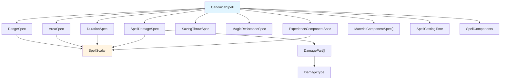
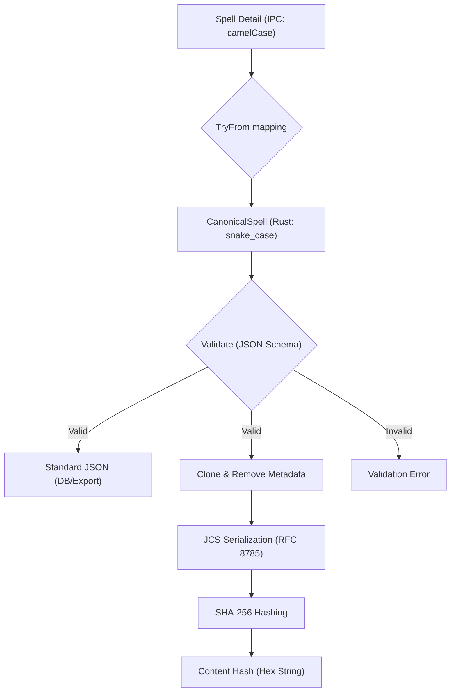

# Architecture

## Canonical Spell Hashing
To ensure spell uniqueness and version tracking, we use a Canonical Spell Hashing system.

### Purpose
- Uniquely identify spells by their content (ignoring ID).
- Prevent duplication during import.
- Enable version tracking of spell data.

### Implementation
- **Model**: `CanonicalSpell` (in `src/models/canonical_spell.rs`).
- **Data Model**: Uses a nested struct hierarchy for complex fields (`SpellRange`, `SpellCastingTime`, `SpellDuration`, `SpellArea`, `SpellDamage`, `SpellComponents`, `SourceRef`).
- **Schema**: `schemas/spell.schema.json` (aligned with the official OpenSpec resource).
- **Serialization**: RFC 8785 (JCS) with sorted keys and array normalization.
- **Hashing**: SHA-256 of the canonical JSON string.
- **Casing Standard**: **All canonical data MUST use `snake_case`.** This distinguishes it from IPC data, which uses `camelCase`.

> 📄 **See [Canonical Serialization Contract](./architecture/canonical-serialization.md)** for the complete specification including normalization rules, string handling modes, default materialization, and detailed examples.

### Expanded Specification System

The canonical spell model uses a rich type system to represent mechanical spell properties with precision:

#### Core Specification Types

**RangeSpec** (`src/models/range_spec.rs`): Structured range representation
- Supports named ranges (Personal, Touch, Unlimited)
- Distance-based ranges with scalar values and units
- Constraint modifiers (line-of-sight, line-of-effect)
- Regional and planar scopes

**AreaSpec** (`src/models/area_spec.rs`): Area of effect representation
- Geometric shapes (radius, sphere, cone, line, cube, cylinder, wall, etc.)
- Dimensional specifications with scalar measurements
- Target-based areas (creatures, objects)
- Regional and scope-based areas
- Motion behavior (moves with caster/target, fixed)

**DurationSpec** (`src/models/duration_spec.rs`): Duration representation
- Named durations (Instantaneous, Permanent, Concentration)
- Time-based durations with units (rounds, turns, hours, etc.)
- Per-level scaling support
- Conditional and usage-limited durations

**SpellDamageSpec** (`src/models/damage.rs`): Damage mechanics
- Multiple damage parts with different types
- Dice-based and scalar damage values
- Per-level scaling with caps
- Combine modes (Sum, Sequence, Alternative)
- Damage type categorization

**SavingThrowSpec** (`src/models/saving_throw.rs`): Saving throw mechanics
- Save types (Negates, Half, Partial, Special)
- Multiple save categories (Death, Petrification, Rod/Staff/Wand, Breath, Spell)
- Difficulty modifiers
- Save timing and targeting

**MagicResistanceSpec** (`src/models/magic_resistance.rs`): Magic resistance interaction
- Applicability flags (Yes, No, Special)
- Resistance behavior on success/failure
- Phase-specific resistance

**ExperienceComponentSpec** (`src/models/experience.rs`): XP cost mechanics
- Cost categories (None, Fixed, Per-Unit, Tiered, Formula)
- Payer identification and timing
- Payment semantics (spend, loss, drain, sacrifice)
- Recoverability constraints

#### Specification Relationships

> [!NOTE]
> The **SpellScalar** type is used throughout specs to represent values that may be fixed or scale per caster level, with optional caps and rounding modes. This provides consistent representation of mechanic values across all specs.

### Parser Architecture

Legacy spell data (from imports or migrations) is converted to these structured specs via a modular parser system:

- **SpellParser** (`src/utils/spell_parser.rs`): Facade delegating to domain parsers
- **RangeParser** (`src/utils/parsers/range.rs`): Parses range text to RangeSpec
- **AreaParser** (`src/utils/parsers/area.rs`): Parses area text to AreaSpec
- **DurationParser** (`src/utils/parsers/duration.rs`): Parses duration text to DurationSpec
- **MechanicsParser** (`src/utils/parsers/mechanics.rs`): Parses damage, saves, MR, XP
- **ComponentsParser** (`src/utils/parsers/components.rs`): Parses components and casting time

See [MIGRATION.md](./MIGRATION.md) for detailed parser patterns and examples.

### Hashing Flow

### Validation
Spells are validated against `schemas/spell.schema.json` before hashing. This ensures:
- Required fields are present.
- Data types match the spec.
- Tradition constraints (Arcane requiring School, Divine requiring Sphere) are strictly enforced (allowing omission of the other).

### Metadata & Versioning
To ensure hash stability, the following are excluded from **canonical** serialisation:
- **Root Metadata**: `id`, `source_refs`, `edition`, `author`, `version`, `license`, `created_at`, `updated_at`.
- **Schema Control**: `schema_version`.
- **All Depths**: `artifacts`, `source_text`.

> [!NOTE]
> These fields are **preserved** in the `canonical_data` column and standard exports; they are only removed during the high-integrity hashing process.
>
> For the complete metadata exclusion rules and field inventory, see the [Canonical Serialization Contract](./architecture/canonical-serialization.md).

