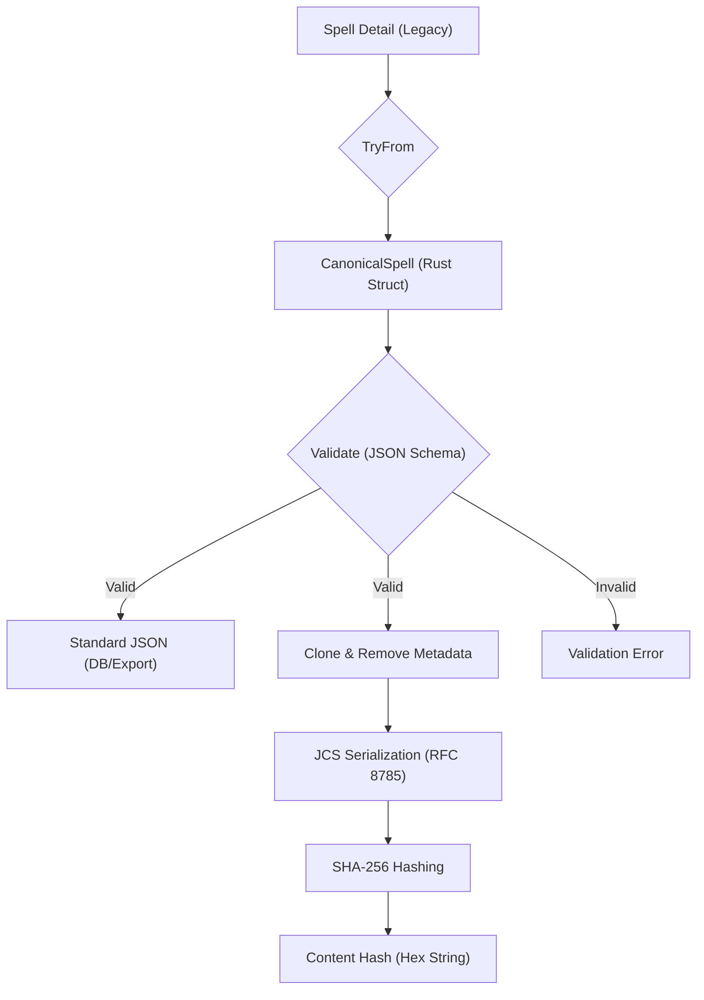

# Architecture

## Canonical Spell Hashing
To ensure spell uniqueness and version tracking, we use a Canonical Spell Hashing system.

### Purpose
- Uniquely identify spells by their content (ignoring ID).
- Prevent duplication during import.
- Enable version tracking of spell data.

### Implementation
- **Model**: `CanonicalSpell` (in `src/models/canonical_spell.rs`).
- **Data Model**: Uses a nested struct hierarchy for complex fields (`SpellRange`, `SpellCastingTime`, `SpellDuration`, `SpellArea`, `SpellDamage`, `SpellComponents`, `SourceRef`).
- **Schema**: `schemas/spell.schema.json` (aligned with the official OpenSpec resource).
- **Serialization**: RFC 8785 (JCS) with sorted keys and array normalization.
- **Hashing**: SHA-256 of the canonical JSON string.

### Hashing Flow

### Validation
Spells are validated against `schemas/spell.schema.json` before hashing. This ensures:
- Required fields are present.
- Data types match the spec.
- Tradition constraints (Arcane requiring School, Divine requiring Sphere) are strictly enforced (allowing omission of the other).

### Metadata & Versioning
To ensure hash stability, the following are excluded from **canonical** serialisation:
- **Metadata**: `id`, `source_refs`, `edition`, `author`, `version`, `license`.
- **Schema Control**: `schema_version`.

> [!NOTE]
> These fields are **preserved** in the `canonical_data` column and standard exports; they are only removed during the high-integrity hashing process.
