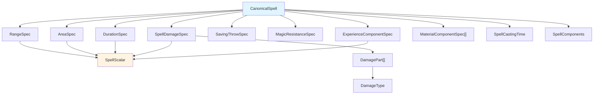
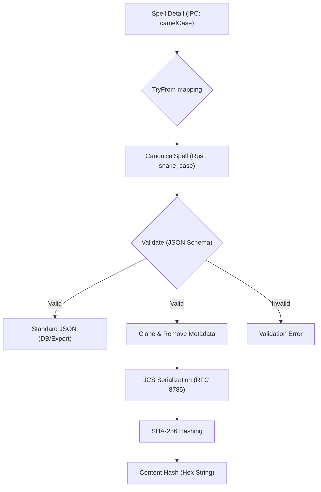

# Architecture

## Canonical Spell Hashing
To ensure spell uniqueness and version tracking, we use a Canonical Spell Hashing system.

### Purpose
- Uniquely identify spells by their content (ignoring ID).
- Prevent duplication during import.
- Enable version tracking of spell data.

### Implementation
- **Model**: `CanonicalSpell` (in `src/models/canonical_spell.rs`).
- **Data Model**: Uses a nested struct hierarchy for complex fields (`SpellRange`, `SpellCastingTime`, `SpellDuration`, `SpellArea`, `SpellDamage`, `SpellComponents`, `SourceRef`).
- **Schema**: `schemas/spell.schema.json` (aligned with the official OpenSpec resource). The schema mandates the unconditional storage of the original legacy text in `raw_legacy_value` for key mechanical fields (`casting_time`, RangeSpec, DurationSpec, AreaSpec, and SavingThrowSpec). These fields are included in the canonical hash. Non-mechanical descriptors use `source_text` (metadata excluded from hash). See [Canonical Serialization](./architecture/canonical-serialization.md#221-text-persistence-raw_legacy_value).
- **Serialization**: RFC 8785 (JCS) with sorted keys and array normalization.
- **Hashing**: SHA-256 of the canonical JSON string.
- **Casing Standard**: **All canonical data MUST use `snake_case`.** The `canonical_data` column (and any stored canonical JSON) is always snake_case; this distinguishes it from IPC data, which uses `camelCase`. The frontend may read with dual keys (e.g. `per_level` / `perLevel`) for resilience when parsing.
- **Robust Normalization**: The system uses a unified enum normalization strategy. Mechanical fields (units, kinds, modes) use `#[serde(alias)]` to natively match various input formats (Title Case, SCREAMING_SNAKE_CASE) and convert them to canonical snake_case during deserialization.

> 📄 **See [Canonical Serialization Contract](./architecture/canonical-serialization.md)** for the complete specification including normalization rules, string handling modes, default materialization, and detailed examples.

### Expanded Specification System

The canonical spell model uses a rich type system to represent mechanical spell properties with precision:

#### Core Specification Types

**RangeSpec** (`src/models/range_spec.rs`): Structured range representation
- Supports named ranges (Personal, Touch, Unlimited)
- Distance-based ranges with scalar values and units
- Constraint modifiers (line-of-sight, line-of-effect)
- Regional and planar scopes

**AreaSpec** (`src/models/area_spec.rs`): Area of effect representation
- Geometric shapes (radius, sphere, cone, line, cube, cylinder, wall, etc.)
- Dimensional specifications with scalar measurements
- Target-based areas (creatures, objects)
- Regional and scope-based areas
- Motion behavior (moves with caster/target, fixed)

**DurationSpec** (`src/models/duration_spec.rs`): Duration representation
- Named durations (Instantaneous, Permanent, Concentration)
- Time-based durations with units (rounds, turns, hours, etc.)
- Per-level scaling support
- Conditional and usage-limited durations

**SpellDamageSpec** (`src/models/damage.rs`): Damage mechanics
- Multiple damage parts with different types
- Dice-based and scalar damage values
- Per-level scaling with caps
- Combine modes (Sum, Sequence, Alternative)
- Damage type categorization

**SavingThrowSpec** (`src/models/saving_throw.rs`): Saving throw mechanics
- Save types (Negates, Half, Partial, Special)
- Multiple save categories (Death, Petrification, Rod/Staff/Wand, Breath, Spell)
- Difficulty modifiers
- Save timing and targeting

**MagicResistanceSpec** (`src/models/magic_resistance.rs`): Magic resistance interaction
- Applicability flags (Yes, No, Special)
- Resistance behavior on success/failure
- Phase-specific resistance

**ExperienceComponentSpec** (`src/models/experience.rs`): XP cost mechanics
- Cost categories (None, Fixed, Per-Unit, Tiered, Formula)
- Payer identification and timing
- Payment semantics (spend, loss, drain, sacrifice)
- Recoverability constraints

#### Specification Relationships

```mermaid
graph TD
    A["CanonicalSpell"] --> B["RangeSpec"]
    A --> C["AreaSpec"]
    A --> D["DurationSpec"]
    A --> E["SpellDamageSpec"]
    A --> F["SavingThrowSpec"]
    A --> G["MagicResistanceSpec"]
    A --> H["ExperienceComponentSpec"]
    A --> I["MaterialComponentSpec[]"]
    A --> J["SpellCastingTime"]
    A --> K["SpellComponents"]

    B --> L["SpellScalar"]
    C --> L
    D --> L
    E --> L
    H --> L

    E --> M["DamagePart[]"]
    M --> N["DamageType"]

    style A fill:#e1f5ff
    style L fill:#fff4e1
```

> [!NOTE]
> The **SpellScalar** type is used throughout specs to represent values that may be fixed or scale per caster level, with optional caps and rounding modes. This provides consistent representation of mechanic values across all specs.

### Parser Architecture

Legacy spell data (from imports or migrations) is converted to these structured specs via a modular parser system:

- **SpellParser** (`src/utils/spell_parser.rs`): Facade delegating to domain parsers
- **RangeParser** (`src/utils/parsers/range.rs`): Parses range text to RangeSpec
- **AreaParser** (`src/utils/parsers/area.rs`): Parses area text to AreaSpec
- **DurationParser** (`src/utils/parsers/duration.rs`): Parses duration text to DurationSpec
- **MechanicsParser** (`src/utils/parsers/mechanics.rs`): Parses damage, saves, MR, XP
- **ComponentsParser** (`src/utils/parsers/components.rs`): Parses components and casting time

See [MIGRATION.md](./MIGRATION.md) for detailed parser patterns and examples. Dual-write scope (legacy → canonical only; canonical-only updates would require backfilling legacy columns) is documented in [MIGRATION.md](./MIGRATION.md#dual-write-scope).

### Hashing Flow

```mermaid
graph TD
    A["Spell Detail (IPC: camelCase)"] --> B{"TryFrom mapping"}
    B --> C["CanonicalSpell (Rust: snake_case)"]
    C --> D{"Validate (JSON Schema)"}
    D -->|Valid| E["Standard JSON (DB/Export)"]
    D -->|Valid| F["Clone & Remove Metadata"]
    F --> G["JCS Serialization (RFC 8785)"]
    G --> H["SHA-256 Hashing"]
    H --> I["Content Hash (Hex String)"]
    D -->|Invalid| J["Validation Error"]
```

### Validation
Spells are validated against `schemas/spell.schema.json` before hashing. This ensures:
- Required fields are present.
- Data types match the spec.
- Tradition constraints (Arcane requiring School, Divine requiring Sphere) are strictly enforced (allowing omission of the other).

### Metadata & Versioning
To ensure hash stability, the following are excluded from **canonical** serialisation:
- **Root Metadata**: `id`, `source_refs`, `edition`, `author`, `version`, `license`, `created_at`, `updated_at`.
- **Schema Control**: `schema_version`.
- **All Depths**: `artifacts`, `source_text`.

> [!NOTE]
> These fields are **preserved** in the `canonical_data` column and standard exports; they are only removed during the high-integrity hashing process.
>
> For the complete metadata exclusion rules and field inventory, see the [Canonical Serialization Contract](./architecture/canonical-serialization.md).

---

## Modal Focus Trap

`ModalShell` (`src/ui/components/Modal.tsx`) uses the native `<dialog>` element with `showModal()`/`close()` for first-class browser focus trapping. The Tauri WebView2 (Chromium) top-layer is used, with a supplemental capture-phase `keydown` listener on `document` to handle a known WebView2 quirk where Tab can escape `showModal()` context.

Background content is disabled via the HTML `inert` attribute while a modal is open (applied in `App.tsx`). Focus returns to the trigger element after close.

The `dialog::backdrop` pseudo-element is styled in `src/index.css`.

---

## Theme persistence and announcements

- **User-facing modes:** `light`, `dark`, and `system` (`ThemeMode` in `apps/desktop/src/store/useTheme.ts`). **System** resolves to light or dark from `matchMedia("(prefers-color-scheme: dark)")` via `resolveThemeMode`.
- **Persistence:** The selected mode is stored under localStorage key **`spellbook-theme`** (`THEME_STORAGE_KEY`). `readStoredThemeMode()` returns `null` when the key is missing or invalid; **`createThemeStore`** then defaults the in-memory mode to **`system`** (`?? "system"`). `sanitizeThemeMode` maps other garbage to `system` at boundaries like pre-hydration. Writes use `setItem` inside `setTheme`; storage failures are swallowed so in-memory theme still updates (`M-002` contract in unit tests).
- **First paint:** `apps/desktop/src/theme/preHydrationTheme.ts` runs before React hydration to set `document.documentElement` class `dark` and `data-theme` to the resolved effective theme so the first frame does not flash the wrong palette.
- **Settings UI:** `SettingsPage.tsx` exposes the theme select and optional “follow system” behaviour; E2E uses `/settings` for persistence and keyboard-navigation checks.
- **Hidden live region (not a toast):** `App.tsx` renders `data-testid="theme-announcement-live-region"` with `aria-live="polite"` and `className="sr-only"`. On real mode transitions it speaks short phrases from `getThemeAnnouncement`: *Light mode*, *Dark mode*, or *System mode*. When the user is in **system** mode and the OS preference changes, the live region announces the **resolved** theme (*Light mode* / *Dark mode*) unless a guard suppresses duplicate announcements on the transition back to system (see coordinated `useEffect` comments in `App.tsx`). Initial mount leaves the region empty so StrictMode does not double-announce.
- **Versus notifications:** Theme changes never use the stacked toast viewport; routine toasts (`NotificationViewport`) remain separate for save success, hash copy, Library add-to-character, etc. (Spellbook Builder errors remain `alert()` until migrated.)

---

## Frontend Spell Editor State and Feedback Flow

### Validation helper

The editor's client-side validation logic lives in the pure helper `apps/desktop/src/ui/spellEditorValidation.ts`. The helper:

- Accepts `SpellEditorValidationInput`: flat `form`, `tradition`, and in-scope structured specs (`rangeSpec`, `durationSpec`, `castingTimeSpec`, `areaSpec`).
- Returns a typed `SpellEditorFieldError[]` array (fields: `field`, `testId`, `message`, `focusTarget`).
- Is side-effect-free and Node-safe — usable in Vitest unit tests without a DOM.
- Exposes `deriveSpellEditorFieldErrors`, `sortFieldErrorsByFocusOrder`, and `getFirstInvalidFocusTarget` — `SpellEditor.tsx` sorts errors and focuses the first target with a mounted DOM `id` after expanding detail panels when needed.

Full contract is documented in [docs/dev/spell_editor_components.md](dev/spell_editor_components.md#spell-editor-validation-architecture).

### Touched-versus-submit state model

`SpellEditor.tsx` tracks two pieces of validation state:

- **`touchedFields: Set<string>`** — fields that have been blurred (text inputs) or changed (selects). Per-field errors render for touched fields.
- **`hasAttemptedSubmit: boolean`** — set on first failed save click. Once set, all errors are visible and the save button is disabled until they are resolved.

Timing rules:
- Text inputs validate on blur.
- Select controls (including Tradition) validate on change.
- Dependent fields (School/Sphere) revalidate immediately when their controlling value (Tradition) changes.

### Tradition-conditional School/Sphere rendering

Arcane and Divine traditions each require a different classification field:

- **Arcane** → School rendered, Sphere unmounted.
- **Divine** → Sphere rendered, School unmounted.

Switching tradition: the newly mounted field wrapper gets `animate-in fade-in`; the hidden field unmounts without an exit-animation placeholder; stale errors for the hidden field are cleared; the newly relevant field is revalidated immediately.

### Save-progress and success feedback

- A re-entry guard activates immediately on save start (prevents double-submit even before visual feedback appears).
- A 300 ms timer runs concurrently; if the save is still pending at threshold, the button label changes from `Save Spell` to `Saving…`.
- Editor inputs are frozen for the duration of the save so the submitted payload cannot change mid-flight.
- On success: `pushNotification("success", "Spell saved.")` is called before `navigate("/")`. The success toast appears in the global notification viewport (mounted in the app shell above the router outlet) and survives the route change.
- The toast does not steal keyboard focus (`aria-live="polite"`).

### Notification-versus-modal boundary contract

| Scenario | Mechanism |
|----------|-----------|
| Routine save success | Zustand notification store → `NotificationViewport` toast |
| Add-to-character from Library row (success / failure) | Toast (`Library.tsx`) |
| Spellbook Builder add/remove failures | `window.alert` (still blocking; not the toast viewport) |
| Search save/delete failure | Toast |
| Backend persistence failure | `Save Error` modal (`modalAlert`) |
| Unsaved-changes navigation guard | `modalConfirm` |
| Delete confirmation | `modalConfirm` |
| Parser reparse failure | `Reparse Error` modal |

This boundary ensures that routine status feedback never interrupts the user's workflow while destructive and hard-error paths still require explicit acknowledgement.

