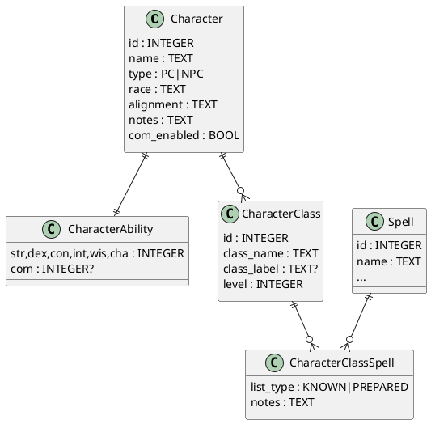

# SPEC-4-Character Profiles Feature

## Background

Goal: add **Character Profiles** to the local AD&D 2e spellbook app so users can manage **PCs and NPCs** with rich data that ties directly into spells. Key drivers:

- Characters can be **PC or NPC**.
- Track all **abilities**: STR, DEX, CON, INT, WIS, CHA, and optional **COM** (Comeliness). **No maximum** integer—the model must allow arbitrarily high values.
- Characters can have **multi‑class** setups, each with its **own level** (no max level).
- Each **class** on the character may have its **own spell list and known spells** (separate from global library), enabling per‑class preparation/known tracking and printing.
- Clean integration with existing **spellbooks**, imports/exports, and local‑only operation.

This spec will define requirements, data model, UI, and migration steps.


## Requirements

Using MoSCoW prioritization, with your confirmed scope (race, alignment, notes; prepared & known per class):

### Must Have
- **Character type**: PC or NPC.
- **Abilities**: STR, DEX, CON, INT, WIS, CHA and optional **COM**; integers with **no maximum** enforced.
- **Identity**: name (required), race, alignment, notes.
- **Multi-class**: a character can have **one or more classes**; each class has an independent **level** (no max) and per-class metadata.
- **Per-class spell management**: for each class on a character, track **Known** and **Prepared** spells (separate sets), with per-spell notes.
- **Spell integration**: prepared/known sets reference existing `spell` records; printing/export pulls full stat blocks.
- **Search & Filter**: find characters by name/type/race/class; filter by class, level range, and ability thresholds.
- **Print**: printable character **spellbook pack** (per-class prepared/known) and **single-character sheet**.
- **Import/Export**: character profiles (including class levels and per-class spell lists) via local **JSON/Markdown bundle** compatible with existing app vault.

### Should Have
- History of level changes per class.
- Per-character **house-rules notes** and spell preparation notes.
- Derived ability modifiers (display-only, computed; not persisted) with rules toggle (2e vs custom).
- Bulk add/remove of spells to prepared/known with filters.

### Could Have
- Per-session prepared lists (snapshots) and quick “restore last session”.
- NPC generator template (fields only, no copyrighted content).

### Won’t Have (v1)
- XP tracking, inventory, feats, or combat stats beyond abilities.
- Automated rules enforcement beyond simple derived displays.

### Acceptance Criteria (MVP)
- Create/edit characters with multi-class and unlimited levels; abilities accept very large integers.
- Add/remove spells to **Known**/**Prepared** per class; print a per-class pack to PDF/Markdown.
- Import/export a character with 2 classes and 100+ spells round-trips without data loss.
- Character search returns results under 150ms (P95) on local DB.


## Method

### Core Class Set (v1)
Fixed list (case-insensitive, stored canonicalized): `Mage, Cleric, Druid, Paladin, Ranger, Bard, Fighter, Thief, Illusionist` plus `Other` (free-text label). Future feature will move to a first-class `class_definition` table and custom spell list rules.

### Data Model (SQLite)

```sql
-- Characters (aligned with existing table)
CREATE TABLE IF NOT EXISTS "character" (
  id INTEGER PRIMARY KEY,
  name TEXT NOT NULL,
  type TEXT NOT NULL DEFAULT 'PC' CHECK(type IN ('PC','NPC')),
  race TEXT,
  alignment TEXT,
  notes TEXT,
  com_enabled INTEGER DEFAULT 0, -- boolean 0/1; whether COM is tracked/displayed
  created_at TEXT DEFAULT (strftime('%Y-%m-%dT%H:%M:%SZ','now')),
  updated_at TEXT
);

-- Abilities: integers with no enforced max
CREATE TABLE IF NOT EXISTS character_ability (
  character_id INTEGER PRIMARY KEY REFERENCES "character"(id) ON DELETE CASCADE,
  str INTEGER NOT NULL,
  dex INTEGER NOT NULL,
  con INTEGER NOT NULL,
  int INTEGER NOT NULL,
  wis INTEGER NOT NULL,
  cha INTEGER NOT NULL,
  com INTEGER                  -- optional; nullable unless com_enabled=1
);

-- Character classes (multi-class, no max level)
CREATE TABLE IF NOT EXISTS character_class (
  id INTEGER PRIMARY KEY,
  character_id INTEGER REFERENCES "character"(id) ON DELETE CASCADE,
  class_name TEXT NOT NULL,    -- one of fixed core or 'Other'
  class_label TEXT,            -- free-text label when class_name='Other'
  level INTEGER NOT NULL CHECK(level >= 0),
  UNIQUE(character_id, class_name, IFNULL(class_label,''))
);

-- Per-class spell links (known & prepared)
CREATE TABLE IF NOT EXISTS character_class_spell (
  character_class_id INTEGER REFERENCES character_class(id) ON DELETE CASCADE,
  spell_id INTEGER REFERENCES spell(id) ON DELETE CASCADE,
  list_type TEXT NOT NULL CHECK(list_type IN ('KNOWN','PREPARED')),
  notes TEXT,
  PRIMARY KEY(character_class_id, spell_id, list_type)
);

-- Optional indexing for fast lookups
CREATE INDEX IF NOT EXISTS idx_char_name ON "character"(name);
CREATE INDEX IF NOT EXISTS idx_char_class ON character_class(character_id, class_name);
CREATE INDEX IF NOT EXISTS idx_ccs_list ON character_class_spell(character_class_id, list_type);
```

### ER Diagram


### Search & Filters
- Character FTS optional (name, race, alignment, notes) via `character_fts` if needed, or plain indexes for MVP.
- Filter by type (PC/NPC), class set (multi-select), level range per selected class, and minimum/maximum ability thresholds.

### Printing
- **Character Sheet (spell-focused)**: identity + abilities + per-class tables (Known, Prepared). Options: include COM, include notes.
- **Spellbook Pack**: per-class selection with compact/full stat blocks; respects existing export engine (Pandoc-first, HTML-print fallback).

### Import/Export (Character Bundles)
- **JSON** (single file):
  ```json
  {
    "format": "adnd2e-character", "format_version": "1.0.0",
    "character": {"name":"Elira","type":"PC","race":"Elf","alignment":"CG","notes":"…","abilities":{"str":10,"dex":18,"con":12,"int":16,"wis":12,"cha":14,"com":17}},
    "classes": [
      {"class_name":"Mage","level":5,
       "known_spells": [{"name":"Magic Missile","class":"Mage","level":1,"source":"Homebrew"}],
       "prepared_spells": [{"name":"Magic Missile","class":"Mage","level":1,"source":"Homebrew"}]
      }
    ]
  }
  ```
- **Markdown** (folder): `character.yml` with identity + abilities + classes; per-class spell lists reference `spells/*.md` or canonical keys.
- Dedupe Rules: spells via canonical key; classes match by `class_name` (and `class_label` when `Other`).
- On import, if class known_spells is missing use the default spell list for that class, if there is one.
- On import, if class prepared_spells is missing, use existing value if the character already exists or use an empty list if the character does not exist.

### Validation & Rules
- No max on abilities or level; client validates integer range only (>=0 for level). Derived modifiers displayed but not stored.
- COM shown only when `com_enabled=1` or when provided in import.

## Implementation

### DB Migration Steps
1. Add `character`, `character_ability`, `character_class`, `character_class_spell` tables and indices.
2. Optional: `character_fts` virtual table if free-text search across notes is desired in v1.
3. Backfill: none required.

### UI Additions (React)
- **Characters Index**: table with quick filters (PC/NPC, class, level, race) and search box.
- **Character Editor**:
  - Identity panel: name, type, race, alignment, notes, toggle for Comeliness.
  - Abilities panel: STR/DEX/CON/INT/WIS/CHA/(COM if enabled). No max constraints.
  - Classes panel: add/remove classes (dropdown of core list + ‘Other’ text); set levels (no max); per-class tabs for **Known** and **Prepared** with filters, add/remove, and notes.
- **Printing**: actions for “Character Sheet (PDF/MD)” and “Spellbook Pack (PDF/MD)”.

### API/Commands (Rust)

Commands follow the application's pattern: `pub async fn name(state: State<'_, Arc<Pool>>, ...) -> Result<T, AppError>` and use `tokio::task::spawn_blocking` for database access.

- `create_character(name: String, character_type: String, notes: Option<String>) -> Result<i64, AppError>` (Existing)
- `update_character_details(id: i64, name: String, character_type: String, race: Option<String>, alignment: Option<String>, notes: Option<String>, com_enabled: i64) -> Result<(), AppError>`
- `delete_character(id: i64) -> Result<(), AppError>`
- `list_characters() -> Result<Vec<Character>, AppError>` (Existing)
- `get_character(id: i64) -> Result<CharacterFull, AppError>`
- `get_character_abilities(character_id: i64) -> Result<CharacterAbilities, AppError>`
- `update_character_abilities(character_id: i64, str: i64, dex: i64, con: i64, int: i64, wis: i64, cha: i64, com: Option<i64>) -> Result<(), AppError>`
- `add_character_class(character_id: i64, class_name: String, class_label: Option<String>, level: i64) -> Result<i64, AppError>`
- `update_character_class_level(id: i64, level: i64) -> Result<(), AppError>`
- `remove_character_class(id: i64) -> Result<(), AppError>`
- `add_character_spell(character_class_id: i64, spell_id: i64, list_type: String, notes: Option<String>) -> Result<(), AppError>`
- `remove_character_spell(character_class_id: i64, spell_id: i64, list_type: String) -> Result<(), AppError>`
- `export_character_bundle(id: i64, format: String) -> Result<String, AppError>`
- `import_character_bundle(path: String) -> Result<i64, AppError>`

### Import/Export Wire-up
- Reuse existing spell dedupe and artifact recording.
- Character bundles validate against schema, insert/update accordingly.

### Future Extensibility (Non-breaking)
- Introduce `class_definition` table with slot/point progressions and allowed spell lists; map `character_class.class_name` to definition.
- Add per-class slot accounting tables; optional per-session snapshots.


## Milestones

**C0 – Schema & CRUD**
- Migrations for `character`, `character_ability`, `character_class`, `character_class_spell`.
- Basic Rust commands and UI forms for create/edit/delete.

**C1 – Per-Class Spell Lists**
- Known/Prepared management per class with filtering and notes.
- Batch add/remove via search + facets.

**C2 – Printing**
- Character Sheet (PDF/MD) and Spellbook Pack (per-class, compact/stat-block layouts).

**C3 – Import/Export**
- JSON and Markdown bundles; collision/merge UI; artifact recording.

**C4 – Search & UX Polish**
- Character filters (type, class, level range, race) and quick search.
- Accessibility/theming parity with main app.

**C5 – Beta Hardening**
- Edge-case fixes (huge ability values, many classes); snapshot tests for print outputs.

## Sample Character Bundles

Two example bundles are attached for testing parsers/importers:

- **JSON**: `character.json` — inline abilities, classes, and reference-style spells.
- **Markdown**: `md_bundle/character.yml` + `md_bundle/spells/*.md` — human-editable variant.

See local file: `character_bundle_examples.zip`.

